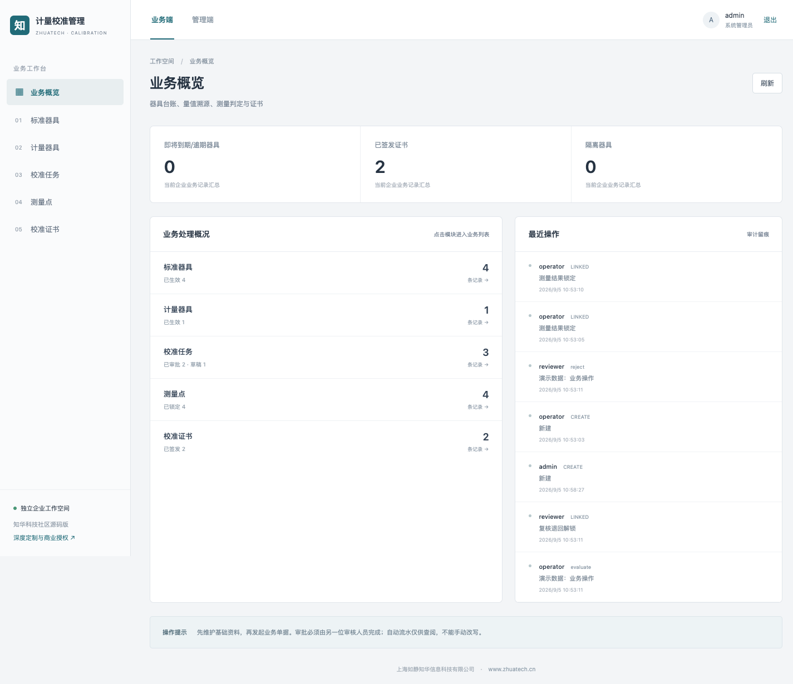
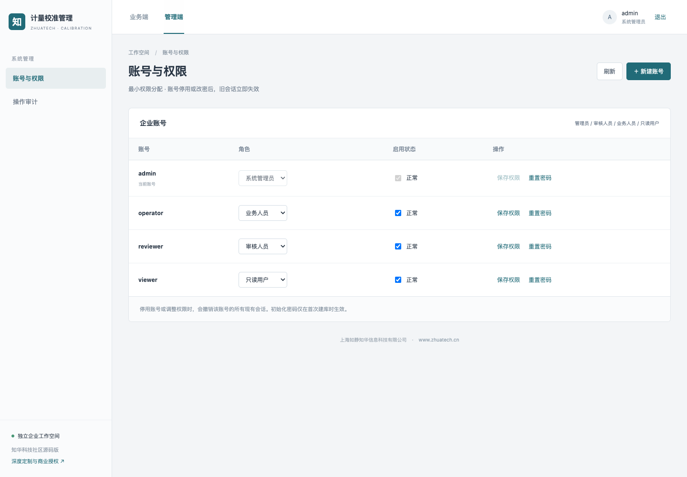
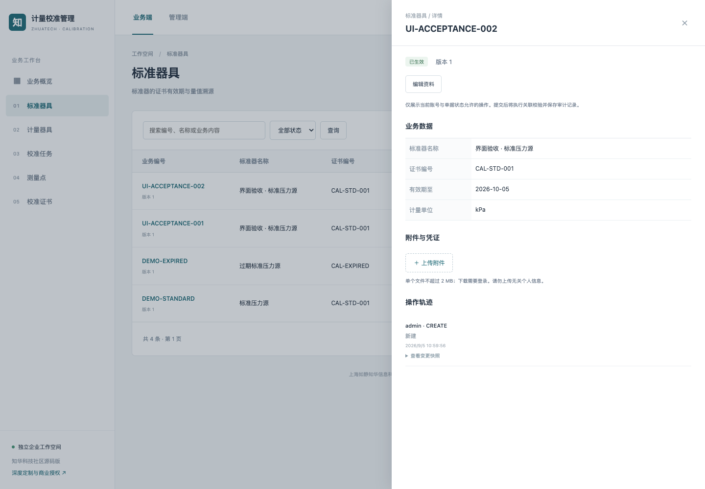

# 知华计量校准管理

> 从测量数据到校准结论，全程可追溯。

由 [知华科技（上海如静知华信息科技有限公司）](https://www.zhuatech.cn/) 提供的 Java + H5 前后端分离企业软件社区源码版，数据库为 MySQL。

**许可先读**：仅限个人学习交流；未经我方书面授权不得商用，也不得用于企业内部生产业务。这里的“开源版”指公开源码学习版本，并非 OSI 认可的开源许可。详见 [LICENSE](LICENSE)。
## 操作与记录

标准器与器具建档 → 校准任务 → 录入多个测量点 → 自动计算误差 → 独立复核 → 签发证书快照/隔离器具

开始校准会校验标准器证书有效期，并阻止同器具重复开展任务。系统用实测值减标称值计算绝对误差与最大误差，不合格会隔离器具；合格审批会更新到期日期并保留测量点和标准器证书快照。

| 模块 | 已实现功能 | 可执行操作 |
|---|---|---|
| 标准器具 | 标准器的证书有效期与量值溯源 | 新建、编辑、查询、详情、导出 |
| 计量器具 | 器具责任人、周期和校准有效期 | 隔离停用、报废 |
| 校准任务 | 标准器有效性、测量点与双人复核 | 开始校准、计算判定、复核签发、退回重测、撤销校准任务 |
| 测量点 | 按标称值、实测值计算绝对误差 | 新建、编辑、查询、详情、导出 |
| 校准证书 | 审批生成不可改写的结果快照与溯源证书 | 业务动作自动生成、查询、追溯、导出 |

下图来自本项目实际运行的 H5 页面，数据为自动执行真实业务接口产生的演示记录，不是效果图。



业务端：模块导航、数量与业务指标、状态查询、详情及操作轨迹；按状态展示可用操作。



管理端：分配业务/审核/只读角色，停用账号、重置密码；独立审计页记录业务和管理动作。
## 本机启动

```bash
docker compose --env-file .env.demo.example up --build -d
```

打开 http://localhost:8088 。演示账号：`admin / Demo-Admin-2026!`，`operator / Demo-Operator-2026!`，`reviewer / Demo-Review-2026!`，`viewer / Demo-Viewer-2026!`。这些均为公开的本机演示密码，禁止在公网或生产使用。

生产配置使用 `.env.example` 填入独立强密码，关闭 `DEMO_MODE`，详见 [部署与备份](docs/DEPLOYMENT.md)。演示模式只在空业务库中初始化数据，不会每次重启重置业务。
<details>
<summary>查看真实业务详情与移动端</summary>



移动端截图：[H5 业务概览](docs/images/mobile.png)。

</details>

## 工程与验证

- 后端：Java 21 / Spring Boot 4.0.7 / JDBC / Flyway / MySQL 8.4，包名 `cn.zhuatech.calibration`。
- 前端：Vue 3 / Vite / 原生 CSS，自适应桌面与移动端，业务端和管理端共用经鉴权的后端 API。
- 支持事务内多记录更新、乐观版本、幂等键、权限控制、提交审批分离、附件摘要、审计快照及 CSV 导出。
- [验收范围与测试步骤](docs/ACCEPTANCE.md) · [架构设计](docs/ARCHITECTURE.md) · [接口说明](docs/API.md) · [测试结果](docs/TEST-RESULTS.md)

```bash
sh scripts/test.sh
```

### 明确的功能边界

一期支持同单位、绝对误差判定和固定天数周期，不含不确定度传播、复杂计量规程、自动连接仪表或第三方资质认证。系统内证书是业务记录，不代表具有法定计量资质的证书。

这是一套可运行、带业务测试的初版实现；测试通过不等于完成了所有生产环境的容量、安全、监管或现场验收。上线前需结合真实数据、业务制度和基础设施进行实施验证。

## 选型依据

[Beamex CMX 校准管理](https://www.beamex.com/us/calibration-software/cmx/)

选型理由是企业流程常见、成熟商用工具通常按订阅或询价交付，且本地项目尚未覆盖这一独立场景；不表示已对全市场免费软件数量或关键词搜索量完成统计。

## 联系知华科技

深度开发定制功能、商业授权、系统集成与实施，请联系 [知华科技官网](https://www.zhuatech.cn/)。

上海如静知华信息科技有限公司提供中小企业信息化、中小企业 AI 转型、OPC 技术支持、软件外包、软件项目外包、软件实施及 FDE 外包服务。可通过以下两个微信二维码咨询：

| 微信咨询一 | 微信咨询二 |
|---|---|
|  |  |

© 2026 上海如静知华信息科技有限公司 · [https://www.zhuatech.cn/](https://www.zhuatech.cn/)
